# PHÂN TÍCH TỔNG QUAN

## Bối cảnh

Trong bối cảnh công nghệ thông tin ngày càng phát triển, việc ứng dụng các hệ thống thông tin vào lĩnh vực y tế đã trở thành xu hướng tất yếu nhằm nâng cao hiệu quả quản lý và chất lượng dịch vụ chăm sóc sức khỏe. Tuy nhiên, tại nhiều bệnh viện và phòng khám quy mô nhỏ đến trung bình, quy trình đặt lịch khám vẫn còn được thực hiện thủ công thông qua quầy tiếp nhận, điện thoại hoặc ghi chép sổ sách.

Cách thức này tồn tại nhiều hạn chế như:

- Tốn nhiều thời gian cho cả bệnh nhân và nhân viên y tế
- Dễ xảy ra sai sót trong việc ghi nhận lịch hẹn
- Khó quản lý số lượng bệnh nhân theo từng bác sĩ
- Không thuận tiện cho bệnh nhân khi cần tra cứu hoặc thay đổi lịch khám

Do đó, việc xây dựng một hệ thống đặt lịch khám bệnh trực tuyến là cần thiết nhằm số hóa quy trình đặt lịch, giảm tải công việc hành chính và nâng cao trải nghiệm của người sử dụng.

## Mục tiêu

Mục tiêu chính của đề tài là xây dựng một website đặt lịch khám bệnh cho **Bệnh viện/Phòng khám ABC** (hoặc XYZ), đáp ứng nhu cầu quản lý và sử dụng trong phạm vi học thuật.

Cụ thể, hệ thống hướng đến các mục tiêu sau:

- Cho phép bệnh nhân đặt lịch khám trực tuyến một cách dễ dàng
- Giúp bác sĩ theo dõi lịch khám và danh sách bệnh nhân theo từng ngày
- Hỗ trợ nhân viên quản trị quản lý thông tin bác sĩ, khoa và lịch hẹn
- Minh họa kiến thức lập trình web nâng cao đã học

## Phạm vi

Do giới hạn về thời gian và phạm vi đồ án học phần, hệ thống được xây dựng với các chức năng cốt lõi sau:

### Phạm vi bao gồm:

- Quản lý người dùng (bệnh nhân, bác sĩ, nhân viên y tế, quản trị viên)
- Đặt lịch khám theo bác sĩ/khoa/thời gian
- Xem, cập nhật và hủy lịch khám
- Quản lý thông tin bác sĩ và khoa
- Lưu trữ dữ liệu trong cơ sở dữ liệu MySQL
- Thanh toán trực tuyến
- Quản lý tài liệu hồ sơ bệnh án (bác sĩ tải lên, bệnh nhân xem/tải xuống)

### Phạm vi không bao gồm:

- Hệ thống bệnh án điện tử toàn phần (EMR) liên thông đa cơ sở
- Kết nối với hệ thống y tế quốc gia
- Gửi thông báo qua SMS

## Các bên liên quan

Hệ thống phục vụ các đối tượng chính sau:

### 1. Bệnh nhân

Là người sử dụng dịch vụ khám bệnh thông qua hệ thống.

**Chức năng:**
- Đăng ký và đăng nhập tài khoản cá nhân
- Cập nhật thông tin cá nhân cơ bản
- Đặt lịch khám theo bác sĩ / chuyên khoa / thời gian
- Xem thông tin chi tiết lịch hẹn (ngày, giờ, bác sĩ, trạng thái)
- Theo dõi lịch sử đặt lịch khám
- Hủy hoặc chỉnh sửa lịch hẹn (trong phạm vi cho phép)
- Xem và tải tài liệu hồ sơ bệnh án do bác sĩ phát hành cho chính mình

### 2. Bác sĩ

Là người trực tiếp khám và điều trị cho bệnh nhân.

**Chức năng:**
- Xem lịch khám theo ngày / tuần
- Theo dõi danh sách bệnh nhân theo từng ca khám
- Xem thông tin cơ bản của bệnh nhân trước khi khám
- Cập nhật trạng thái lịch khám (đã khám, vắng mặt, hủy)
- Ghi chú thông tin khám bệnh (nếu hệ thống có hỗ trợ)
- Tải lên, cập nhật metadata, và quản lý tài liệu hồ sơ bệnh án gắn với phiếu khám

### 3. Nhân viên y tế / Lễ tân

Là người hỗ trợ vận hành hoạt động khám bệnh hằng ngày.

**Chức năng:**
- Tạo lịch khám hộ bệnh nhân (đặt lịch trực tiếp tại quầy)
- Xác nhận, chỉnh sửa hoặc hủy lịch hẹn theo yêu cầu
- Theo dõi danh sách lịch hẹn trong ngày
- Hỗ trợ quản lý luồng bệnh nhân đến khám
- Kiểm tra thông tin bệnh nhân và bác sĩ
- Không có quyền xem/tải/xóa tài liệu hồ sơ bệnh án

### 4. Quản trị viên (Admin)

Là người quản lý và duy trì toàn bộ hệ thống.

**Chức năng:**
- Quản lý cấu trúc dữ liệu của hệ thống
- Quản lý tài khoản người dùng (bệnh nhân, bác sĩ, nhân viên)
- Thêm, sửa, xóa thông tin bác sĩ, chuyên khoa, khung giờ khám
- Phân quyền người dùng
- Giám sát hoạt động hệ thống và đảm bảo tính ổn định
- Sao lưu và bảo trì dữ liệu

## Công nghệ sử dụng

Hệ thống được xây dựng dựa trên các công nghệ và công cụ sau:

| Thành phần | Công nghệ |
|------------|-----------|
| **Ngôn ngữ lập trình** | PHP, JavaScript |
| **Công nghệ giao diện** | HTML, CSS |
| **Framework và thư viện** | React, Laravel |
| **Hệ quản trị cơ sở dữ liệu** | MySQL |
| **Công cụ phát triển** | Visual Studio Code, XAMPP (Apache, MySQL), GitHub (quản lý mã nguồn) |

---

# PHÂN TÍCH NGHIỆP VỤ

## Sơ đồ usecase

### Tác nhân (Actors)

Hệ thống có 4 tác nhân chính:

- **Bệnh nhân (BENHNHAN):** đặt / xem / hủy / đổi lịch, quản lý hồ sơ cá nhân, xem tài liệu hồ sơ bệnh án của chính mình.
- **Bác sĩ (BACSI):** xem lịch khám, tiếp nhận bệnh nhân, cập nhật trạng thái, lập phiếu khám, kê đơn, quản lý tài liệu hồ sơ bệnh án.
- **Nhân viên y tế / Lễ tân (NHANVIEN):** đặt lịch hộ, check-in bệnh nhân, chỉnh sửa/hủy lịch theo yêu cầu.
- **Quản trị viên (ADMIN):** quản lý danh mục, người dùng, phân quyền, cấu hình hệ thống.

### Nhóm chức năng chính theo tác nhân

**Bệnh nhân**
- Đăng ký/đăng nhập
- Cập nhật hồ sơ bệnh nhân
- Xem danh sách chuyên khoa/bác sĩ/dịch vụ
- Xem khung giờ trống theo bác sĩ/ngày
- Đặt lịch khám
- Xem lịch sử lịch hẹn
- Hủy/đổi lịch hẹn (theo quy định thời gian)
- Xem/tải tài liệu hồ sơ bệnh án thuộc hồ sơ của chính mình

**Bác sĩ**
- Xem lịch khám theo ngày
- Xem danh sách bệnh nhân theo khung giờ
- Khám bệnh: cập nhật/hoàn thiện **phiếu khám** (phiếu được tạo khi tiếp nhận)
- Kê **đơn thuốc**
- Chỉ định dịch vụ (xét nghiệm/siêu âm/...) và/hoặc tải tài liệu liên quan
- Tải lên/cập nhật/xóa tài liệu hồ sơ bệnh án cho bệnh nhân thuộc ca khám của mình

**Nhân viên / Lễ tân**
- Tạo hồ sơ bệnh nhân (bao gồm walk-in)
- Đặt lịch hộ bệnh nhân
- Check-in bệnh nhân (cập nhật giờ đến thực tế) + tạo **phiếu khám** khi tiếp nhận
- Đổi/hủy lịch theo yêu cầu
- Tra cứu lịch trong ngày
- Không được truy cập tài liệu hồ sơ bệnh án (chỉ thấy thông tin lịch hẹn cần thiết cho vận hành)

**Admin**
- Quản lý người dùng, vai trò, quyền
- Quản lý danh mục: chuyên khoa, phòng khám, bác sĩ, dịch vụ, gói khám
- Quản lý lịch làm việc bác sĩ
- Cấu hình hệ thống (quy định hủy/đổi lịch, số ngày đặt trước tối đa, ...)

### Sơ đồ use case (PlantUML)

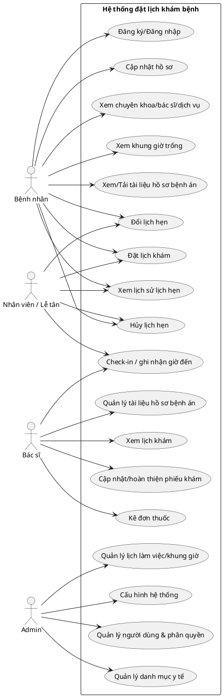

### Use case trọng tâm (định nghĩa chi tiết)

#### UC-01: Đặt lịch khám

| Mục | Nội dung |
|---|---|
| **Mô tả** | Bệnh nhân (hoặc nhân viên lễ tân đặt hộ) chọn bác sĩ/chuyên khoa, chọn khung giờ trống và chọn **một hoặc nhiều** mục (dịch vụ đơn lẻ và/hoặc gói khám) để tạo lịch hẹn. |
| **Tác nhân** | Bệnh nhân, Nhân viên/Lễ tân |
| **Tiền điều kiện** | (1) Bệnh nhân tồn tại; (2) Bác sĩ có lịch làm việc theo ngày (có `lich_lam_viec_bac_si` hợp lệ); (3) Khung giờ còn trống; (4) Ngày khám không trùng ngày nghỉ lễ/nghỉ riêng bác sĩ; (5) Chọn **ít nhất 1** mục. Với mỗi mục, chỉ được có `dich_vu_id` **hoặc** `goi_kham_id`. |
| **Hậu điều kiện** | Tạo bản ghi `lich_hen`; tạo các dòng `dich_vu_lich_hen` tương ứng; khung giờ tương ứng chuyển sang `da_dat`. |
| **Luồng chính** | 1) Chọn chuyên khoa/bác sĩ → 2) Chọn ngày khám → 3) Hệ thống hiển thị khung giờ trống → 4) Chọn khung giờ → 5) Chọn các mục dịch vụ/gói khám → 6) Nhập lý do khám (tuỳ chọn) → 7) Xác nhận đặt lịch → 8) Hệ thống tạo lịch hẹn + danh sách mục và cập nhật trạng thái khung giờ. |
| **Luồng phụ/ngoại lệ** | A1) Khung giờ vừa bị đặt: hệ thống báo hết chỗ và yêu cầu chọn lại. A2) Ngày khám là ngày nghỉ lễ hoặc bác sĩ nghỉ: hệ thống không hiển thị khung giờ hoặc chặn đặt lịch. A3) Vượt quá số ngày đặt trước tối đa: hệ thống chặn theo cấu hình. |

#### UC-02: Hủy lịch hẹn

| Mục | Nội dung |
|---|---|
| **Mô tả** | Bệnh nhân/nhân viên hủy lịch hẹn trước giờ khám theo quy định. |
| **Tác nhân** | Bệnh nhân, Nhân viên/Lễ tân |
| **Tiền điều kiện** | Lịch hẹn tồn tại và chưa ở trạng thái `da_huy`/`da_hoan_tat`. Đáp ứng quy định tối thiểu trước giờ khám (cấu hình hệ thống). |
| **Hậu điều kiện** | `lich_hen.trang_thai` → `da_huy`; khung giờ được mở lại (`khung_gio_kham.trang_thai` → `trong`). |
| **Luồng chính** | 1) Chọn lịch hẹn → 2) Chọn lý do hủy (`ly_do_huy_id`) hoặc nhập `ly_do_huy_khac` → 3) Xác nhận → 4) Hệ thống cập nhật trạng thái và mở lại khung giờ. |
| **Ngoại lệ** | A1) Quá hạn hủy: hệ thống từ chối và hiển thị quy định. |

#### UC-03: Đổi lịch hẹn

| Mục | Nội dung |
|---|---|
| **Mô tả** | Bệnh nhân/nhân viên đổi sang khung giờ khác (và/hoặc bác sĩ khác) theo quy định. |
| **Tác nhân** | Bệnh nhân, Nhân viên/Lễ tân |
| **Tiền điều kiện** | Lịch hẹn tồn tại; còn trong thời gian cho phép đổi lịch (cấu hình). Khung giờ mới hợp lệ và còn trống. |
| **Hậu điều kiện** | Cập nhật `lich_hen.khung_gio_id` và `ngay_hen`; mở lại khung giờ cũ và khóa khung giờ mới. |
| **Luồng chính** | 1) Chọn lịch hẹn cần đổi → 2) Chọn ngày/khung giờ mới → 3) Hệ thống kiểm tra ràng buộc → 4) Xác nhận → 5) Hệ thống cập nhật lịch hẹn và trạng thái khung giờ. |
| **Ngoại lệ** | A1) Khung giờ mới hết chỗ/không hợp lệ: yêu cầu chọn lại. |

#### UC-04: Check-in bệnh nhân

| Mục | Nội dung |
|---|---|
| **Mô tả** | Nhân viên/lễ tân (hoặc bác sĩ nếu được phân quyền) xác nhận bệnh nhân đã đến khám và **tạo phiếu khám** ở trạng thái tiếp nhận (bác sĩ sẽ hoàn thiện trong quá trình khám). |
| **Tác nhân** | Nhân viên/Lễ tân, Bác sĩ |
| **Tiền điều kiện** | Có lịch hẹn hợp lệ trong ngày; bệnh nhân đến khám. |
| **Hậu điều kiện** | Cập nhật `lich_hen.gio_den_thuc_te`; tạo bản ghi `phieu_kham` ở trạng thái tiếp nhận (nếu chưa có). |
| **Luồng chính** | 1) Tra cứu lịch theo ngày/bác sĩ → 2) Chọn bệnh nhân → 3) Ghi nhận giờ đến thực tế → 4) Tạo phiếu khám (nếu chưa có) → 5) Lưu. |

#### UC-05: Quản lý tài liệu hồ sơ bệnh án

| Mục | Nội dung |
|---|---|
| **Mô tả** | Bác sĩ tải lên và quản lý tài liệu hồ sơ bệnh án theo từng phiếu khám; bệnh nhân được xem/tải tài liệu thuộc hồ sơ của chính mình. |
| **Tác nhân** | Bác sĩ, Bệnh nhân |
| **Tiền điều kiện** | (1) Có `phieu_kham` hợp lệ; (2) Bác sĩ chỉ thao tác trên phiếu khám do mình phụ trách; (3) Bệnh nhân chỉ truy cập tài liệu của chính mình; (4) Nhân viên y tế không có quyền truy cập tài liệu. |
| **Hậu điều kiện** | Tài liệu được lưu trong `tai_lieu_ho_so` với `file_url`; lịch sử tài liệu có thể tra cứu theo bệnh nhân/phiếu khám; quyền truy cập tuân thủ RBAC. |
| **Luồng chính** | 1) Bác sĩ mở phiếu khám → 2) Tải lên tài liệu (kết quả xét nghiệm, hình ảnh, hướng dẫn điều trị, ...) → 3) Lưu metadata tài liệu → 4) Bệnh nhân vào hồ sơ cá nhân và xem/tải tài liệu tương ứng. |
| **Ngoại lệ** | A1) Người dùng không đúng quyền (đặc biệt NHANVIEN): trả về từ chối truy cập. A2) Tài liệu không thuộc bệnh nhân hiện tại: từ chối truy cập. A3) File sai định dạng/kích thước: từ chối tải lên. |

### Trạng thái lịch hẹn (khuyến nghị dùng làm “nguồn sự thật” cho BA)

Trạng thái `lich_hen.trang_thai` trong DB gồm: `dang_cho`, `da_thanh_toan`, `da_xac_nhan`, `da_hoan_tat`, `da_huy`, `khong_den`.

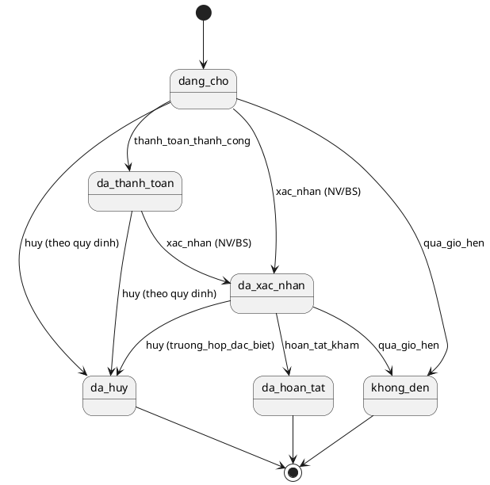

## Sơ đồ flowchart

### 1) Quy trình đặt lịch khám của bệnh nhân

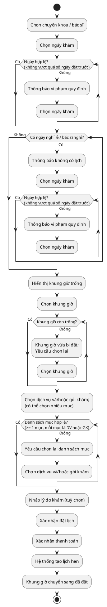

### 2) Quy trình quản lý lịch khám của bác sĩ

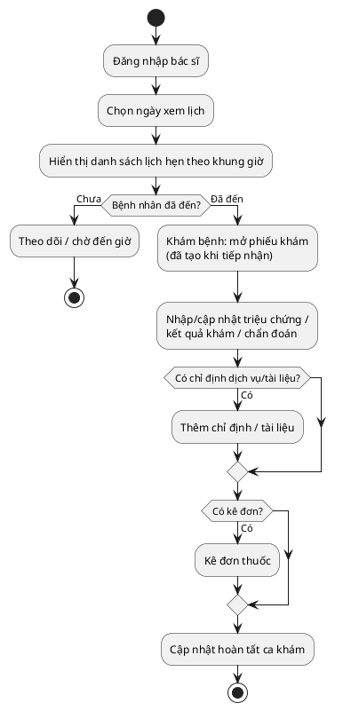

### 3) Quy trình khám bệnh của bệnh nhân

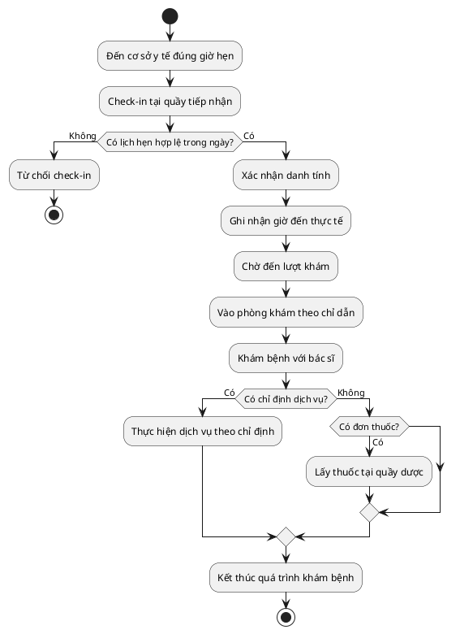

### 4) Quy trình tạo và quản lý lịch khám của nhân viên y tế / lễ tân

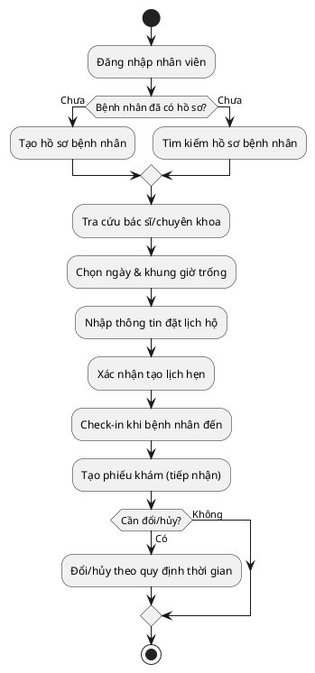

### 5) Quy trình quản lý người dùng và dữ liệu của quản trị viên

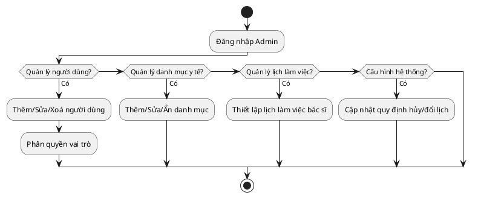

### 6) Quy trình thiết lập lịch làm việc & sinh khung giờ khám

```plantuml
@startuml
start

:Admin/Bác sĩ thiết lập lịch;

if (Tạo mới ca mẫu?) then (Có)
  :Nhập thông tin ca mẫu;\n(`lich_lam_viec`)
  :Lưu `lich_lam_viec`;
endif

:Chọn bác sĩ + ngày làm việc;
:Chọn ca mẫu (`lich_lam_viec_id`)\n+ phòng khám (tuỳ chọn);

if (Trùng lịch ngày của bác sĩ?) then (Có)
  :Từ chối tạo phân công;
  stop
endif

:Tạo phân công theo ngày;\n(`lich_lam_viec_bac_si`)

while (Sinh slot từ giờ bắt đầu đến giờ kết thúc) is (Còn)
  :Tạo 1 dòng `khung_gio_kham`\ntrạng thái `trong`;
endwhile (Hết)

stop
@enduml
```

### 7) Quy trình tra cứu khung giờ trống theo bác sĩ/ngày

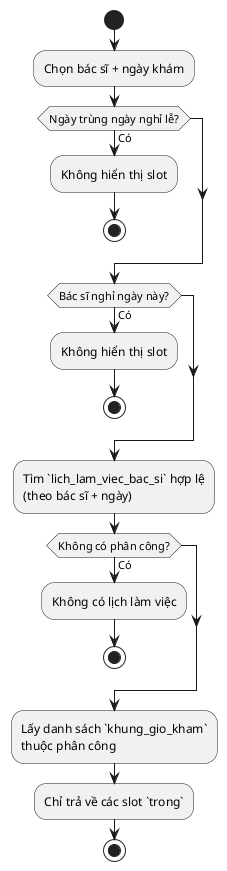

### 8) Quy trình hủy lịch hẹn (theo cấu hình hệ thống)

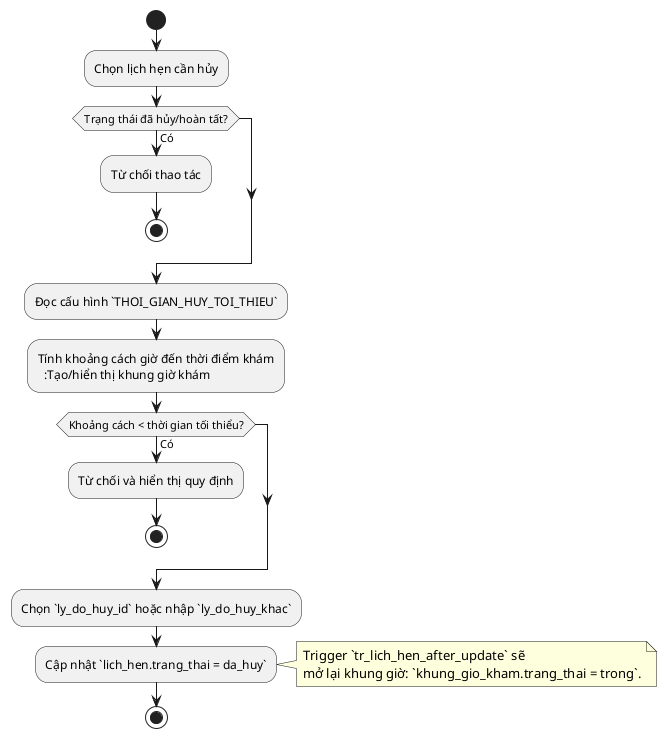

### 9) Quy trình đổi lịch hẹn (mở slot cũ, khóa slot mới)

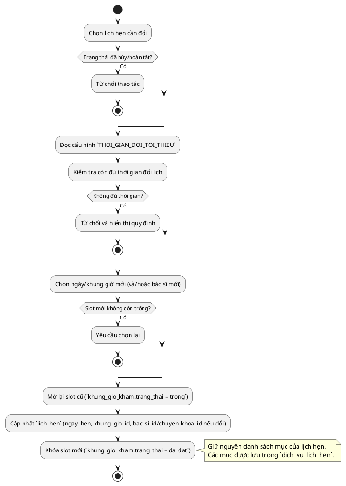

### 10) Quy trình check-in & tự tạo phiếu khám (trigger)

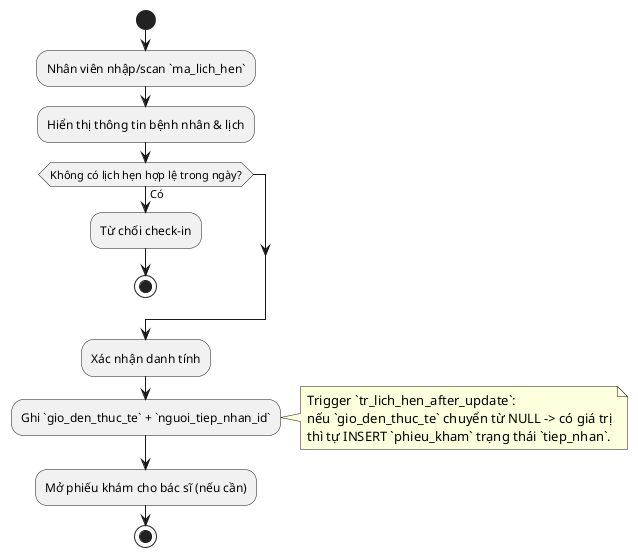

### 11) Quy trình chỉ định dịch vụ & lưu kết quả/tài liệu

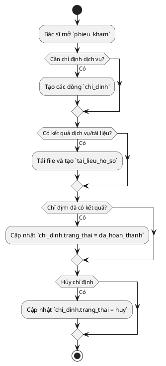

### 12) Quy trình bệnh nhân xem/tải tài liệu hồ sơ bệnh án

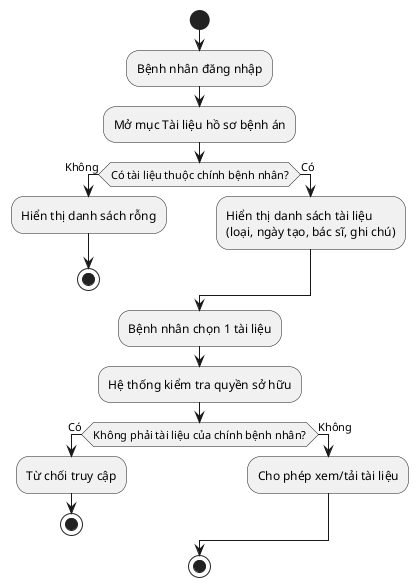


# PHÂN TÍCH HỆ THỐNG

## Tình trạng hiện tại

Hiện nay, quy trình đặt lịch khám chủ yếu được thực hiện theo phương thức thủ công thông qua quầy tiếp nhận hoặc liên hệ trực tiếp bằng điện thoại. Nhân viên tiếp nhận có nhiệm vụ ghi nhận thông tin bệnh nhân, bác sĩ và thời gian khám vào sổ sách hoặc các biểu mẫu rời rạc.

### Hạn chế của phương thức hiện tại:

- Việc quản lý lịch khám phụ thuộc nhiều vào con người, dễ xảy ra nhầm lẫn
- Khó theo dõi số lượng bệnh nhân theo từng bác sĩ hoặc khung giờ
- Bệnh nhân phải trực tiếp đến cơ sở y tế hoặc gọi điện để đặt lịch
- Không có hệ thống tập trung để tra cứu hoặc thống kê dữ liệu

Những hạn chế trên cho thấy sự cần thiết của việc xây dựng một hệ thống đặt lịch khám bệnh trực tuyến nhằm thay thế và cải thiện quy trình hiện tại.

## Yêu cầu chức năng

Các yêu cầu chức năng mô tả những chức năng chính mà hệ thống cần cung cấp. Các yêu cầu này được trình bày dưới dạng _"Hệ thống phải cho phép…"_.

### Yêu cầu đối với bệnh nhân

- **FR-01:** Hệ thống phải cho phép bệnh nhân đăng ký tài khoản bằng thông tin cá nhân hợp lệ
- **FR-02:** Hệ thống phải cho phép bệnh nhân đăng nhập vào hệ thống bằng tài khoản đã đăng ký
- **FR-03:** Hệ thống phải cho phép bệnh nhân xem danh sách bác sĩ và các khoa khám bệnh
- **FR-04:** Hệ thống phải cho phép bệnh nhân đặt lịch khám theo bác sĩ, ngày và khung giờ trống
- **FR-05:** Hệ thống phải cho phép bệnh nhân xem danh sách các lịch khám đã đặt
- **FR-06:** Hệ thống phải cho phép bệnh nhân hủy lịch khám trước thời điểm khám theo quy định của hệ thống
- **FR-19:** Hệ thống phải cho phép bệnh nhân xem danh sách tài liệu hồ sơ bệnh án thuộc hồ sơ của chính mình
- **FR-20:** Hệ thống phải cho phép bệnh nhân xem/tải xuống tài liệu hồ sơ bệnh án được bác sĩ phát hành

### Yêu cầu đối với bác sĩ

- **FR-07:** Hệ thống phải cho phép bác sĩ đăng nhập vào hệ thống bằng tài khoản được cấp
- **FR-08:** Hệ thống phải cho phép bác sĩ xem lịch khám theo từng ngày
- **FR-09:** Hệ thống phải cho phép bác sĩ xem danh sách bệnh nhân đã đăng ký khám trong lịch của mình
- **FR-21:** Hệ thống phải cho phép bác sĩ tải lên và quản lý tài liệu hồ sơ bệnh án gắn với phiếu khám do mình phụ trách

### Yêu cầu đối với nhân viên y tế/lễ tân

- **FR-10:** Hệ thống phải cho phép nhân viên y tế đăng nhập vào hệ thống
- **FR-11:** Hệ thống phải cho phép nhân viên y tế xem danh sách lịch khám theo ngày
- **FR-12:** Hệ thống phải cho phép nhân viên y tế tạo lịch khám cho bệnh nhân tại quầy
- **FR-13:** Hệ thống phải cho phép nhân viên y tế chỉnh sửa hoặc hủy lịch khám khi cần thiết
- **FR-14:** Hệ thống phải cho phép nhân viên y tế tra cứu thông tin bệnh nhân
- **FR-15:** Hệ thống phải cho phép nhân viên y tế cập nhật trạng thái lịch khám (đã đến, vắng mặt, hủy)
- **FR-22:** Hệ thống không cho phép nhân viên y tế truy cập (xem/tải/sửa/xóa) tài liệu hồ sơ bệnh án

### Yêu cầu đối với quản trị viên/admin

- **FR-16:** Hệ thống phải cho phép quản trị viên quản lý tài khoản người dùng (thêm, sửa, xóa, phân quyền)
- **FR-17:** Hệ thống phải cho phép quản trị viên quản lý thông tin và cấu trúc dữ liệu (chuẩn hóa thông tin của tên phòng, tên thuốc, tên dịch vụ, danh mục mã ICD-10 cho chẩn đoán v.v)
- **FR-18:** Hệ thống phải cho phép quản trị viên quản lý lịch khám và khung giờ khám

## Yêu cầu phi chức năng

Yêu cầu phi chức năng mô tả các tiêu chí về chất lượng và ràng buộc của hệ thống.

### Hiệu năng

- Hệ thống phải phản hồi trong thời gian hợp lý khi người dùng thao tác
- Hệ thống có khả năng xử lý đồng thời nhiều yêu cầu đặt lịch

### Bảo mật

- Hệ thống yêu cầu người dùng đăng nhập trước khi sử dụng
- Phân quyền rõ ràng giữa bệnh nhân, bác sĩ và quản trị viên
- Tài liệu hồ sơ bệnh án chỉ được truy cập bởi bác sĩ phụ trách và bệnh nhân sở hữu hồ sơ; nhân viên y tế bị từ chối truy cập

### Khả năng sử dụng

- Giao diện thân thiện, dễ sử dụng
- Phù hợp với người dùng không có nhiều kiến thức công nghệ

### Độ tin cậy

- Dữ liệu được lưu trữ tập trung trong cơ sở dữ liệu
- Hạn chế tối đa mất mát dữ liệu trong quá trình sử dụng

## Phương án kiến trúc

Hệ thống được xây dựng theo **kiến trúc đơn khối (Monolithic Architecture)** với mô hình client–server:

- **Client (Trình duyệt web):** giao diện người dùng (HTML, CSS, JS) cho bệnh nhân, bác sĩ, nhân viên y tế, và quản trị viên
- **Server (PHP + Apache):** xử lý logic nghiệp vụ, nhận yêu cầu từ client, truy vấn cơ sở dữ liệu
- **Database (MySQL):** lưu trữ thông tin người dùng, lịch khám, bác sĩ, khoa

---

_[More content to be added later]_